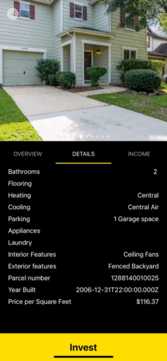

<h1 align="center"> l.dorado</h1>

<h3 align="center">React Native App for crowd funding real estate investing</h3>

---

### Demo :house_with_garden:

l.dorado makes investing in real estate easy and affordable [ldorado](https://ldorado.herokuapp.com/)

1. Singup to get access to dashboard and test the website
2. Use Stripe test card numbers to add money to wallet `4242 4242 4242 4242` or `4000 0027 6000 3184`
3. Invest in properties to see them added to your portfolio
4. Sell properties for the public

### Technologies :rocket:

#### Frontend

- [React](https://reactjs.org/)
- [React Native](https://reactnative.dev/)
- [Expo](https://expo.dev/)
- [Redux](https://redux.js.org/)
- [React Redux](https://react-redux.js.org/)
- [Axios](https://axios-http.com/)
- [Formik](https://formik.org/)
- [yup](https://github.com/jquense/yup)
- [Stripe](https://stripe.com/)
- [React Router](https://reactrouter.com/web/guides/quick-start)
- [react-icons](https://react-icons.github.io/react-icons)
- [react-datepicker](https://reactdatepicker.com/)
- [react-phone-input-2](https://bl00mber.github.io/react-phone-input-2.html)
- [react-dropzone](https://react-dropzone.js.org/)
- [react-carousel-minimal](https://github.com/sahilsaha7773/react-carousel-minimal)

#### Backend

- [Node.js](https://nodejs.org/)
- [NPM](https://www.npmjs.com/)
- [Express.js](https://expressjs.com/)
- [MongoDB](https://www.mongodb.com/atlas/database)
- [Mongoose](https://mongoosejs.com/)
- [dotenv](https://github.com/motdotla/dotenv)
- [Stripe](https://stripe.com/)
- [Cloudinary](https://cloudinary.com/)
- [Joi](https://joi.dev/)
- [bcrypt.js](https://github.com/dcodeIO/bcrypt.js)
- [JWT](https://jwt.io/)
- [cors](https://github.com/expressjs/cors)
- [uuid](https://github.com/uuidjs/uuid)
- [Heroku](https://dashboard.heroku.com/)

> Made with :heart: by Ahmed Abdelsamea _aka BNA_
